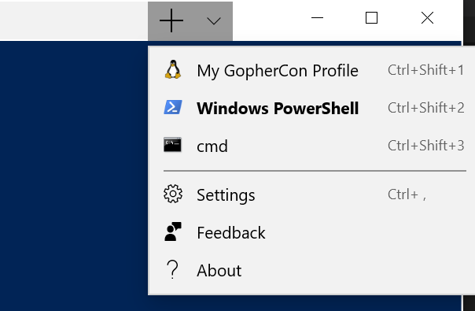

## Open Source Development with the Windows Terminal (Preview) and the Windows Subsystem for Linux (WSL) 2

This project walks you through setting up and customizing a Windows PC for Open Source development.  We'll introduce you to Windows Terminal and the Windows Subsystem for Linux (WSL) 2. At the end of this lab you'll use VS Code to debug a Go project running in WSL. 

## Prerequisites

If you are **not** at an event, please see [REQUIREMENTS](REQUIREMENTS.md) to install the prerequisites for this lab.

## Configure the Windows Terminal

Open Windows Terminal (found in taskbar). Press **Ctrl+,** to edit the settings file (or use the Terminal menu and select "settings")

Scroll down to `"profiles"` (or type `Ctrl+P`, type `@`, then `profiles` to jump to the correct property in VS Code). Insert the profile below after the first `[`:

```json
{
    "guid" : "{c6eaf9f4-56a1-5fdc-b5cf-066e8a4b1e40}",
    "acrylicOpacity" : 0.5,
    "closeOnExit" : true,
    "colorScheme" : "Campbell",
    "commandline" : "wsl.exe -d Ubuntu-18.04",
    "cursorColor" : "#FFFFFF",
    "cursorShape" : "bar",
    "fontFace" : "Consolas",
    "fontSize" : 12,
    "historySize" : 9001,
    "icon" : "ms-appx:///ProfileIcons/{9acb9455-ca41-5af7-950f-6bca1bc9722f}.png",
    "name" : "My GopherCon Profile",
    "padding" : "4, 2, 4, 2",
    "snapOnInput" : true,
    "startingDirectory" : "%USERPROFILE%",
    "useAcrylic" : false
},
```

Save the changes. **Ctrl+S**

**Note:** If you make a mistake while editing your [profiles.json](profiles.json) (which can stop it opening) you can open `%USERPROFILE%\AppData\Local\Packages\Microsoft.WindowsTerminal_8wekyb3d8bbwe\RoamingState` (an easy way to do this is to press `Windows Key+R`, `<paste>`, `Ok`) and delete `profiles.json`. The Terminal will re-create a fresh profile for you when you open it.

On the Windows Terminal, select the down arrow next to the plus(+) sign as shown in this image. In the drop down, select: `My GopherCon Profile`. 



This profile will open an Ubuntu 18.04 bash shell. 

Feel free to change any of the profile settings and the Terminal will automatically reload with your changes as you make them.

## Customize Windows Terminal

Let's make the GopherCon profile look more like Ubuntu. Using your GopherCon profile, update the properties below in the JSON. As you update your profile, the Terminal will automatically reflect your changes.

1. Set `"useAcrylic" : false,`
2. Set `"fontFace" : "Ubuntu Mono",`
3. Set `"fontSize" : 14,`
4. Set `"colorScheme" : "One Half Dark",`
5. Set `"cursorShape" : "filledBox",`
6. Add `"backgroundImage" : "ms-appdata:///roaming/ubuntu.jpg",`
7. Add `"backgroundImageOpacity" : 0.8,`
8. Add `"tabTitle" : "Ubuntu 18.04"`

After adding these changes, your profile should look like this:
```json
{
    "acrylicOpacity" : 0.5,
    "backgroundImage" : "ms-appdata:///roaming/ubuntu.jpg",
    "backgroundImageOpacity" : 0.80000001192092896,
    "closeOnExit" : true,
    "colorScheme" : "One Half Dark",
    "commandline" : "wsl.exe -d Ubuntu-18.04",
    "cursorColor" : "#FFFFFF",
    "cursorShape" : "filledBox",
    "fontFace" : "Ubuntu Mono",
    "fontSize" : 14,
    "guid" : "{c6eaf9f4-56a1-5fdc-b5cf-066e8a4b1e40}",
    "historySize" : 9001,
    "icon" : "ms-appx:///ProfileIcons/{9acb9455-ca41-5af7-950f-6bca1bc9722f}.png",
    "name" : "My GopherCon Profile",
    "padding" : "4, 2, 4, 2",
    "snapOnInput" : true,
    "startingDirectory" : "%USERPROFILE%",
    "useAcrylic" : false
},
```

Documentation for the settings in the profiles.json file can be found here: <https://github.com/microsoft/terminal/blob/master/doc/cascadia/SettingsSchema.md>

## tmux

To have multiple panes within our Ubuntu 18 shell we can use tmux. Here's how:
1. Open the Ubuntu 18 shell.
2. Start a new tmux session by typing `tmux` and pressing enter
3. Add panes using the following:
    - Press **Ctrl+B** and then **"** to split the screen vertically
    - Press **Ctrl+B** and then **%** to split the screen horizontally
    - Use **Ctrl+B** and then the arrow keys to navigate between the screens
    - Use whatever mix and match of cool apps you'd like here. I recommend using `htop` in the top Window, `cmatrix` on the bottom left and `cacafire`
    - To quit a window press **Ctrl+B** and then **x** and then press **y** to accept. 
    - Quit all windows to exit the tmux session.

## Run a Go project in WSL

In the Terminal using your GopherCon profile, navigate to the folder for our sample application:

```bash
cd ~/azure-go-labs/1-app-hello-echo
```

Run our application with `go run`

```bash
go run main.go
```

Use a web browser to open <http://wsl.local> to see the site is working. You are now running the Linux version of Go locally on Windows via WSL. 

If you are running `go run main.go` inside tmux, mentioned above, you can open another pane and run `curl localhost:8080/echo` or [hey](https://github.com/rakyll/hey) via `hey http://localhost:8080/echo' to send some load to our application.

**Note:** This preview version of WSL 2 requires obtaining the ip address of the WSL 2 distro in order to browse a web site hosted in WSL 2. We have made localhost available via `wsl.local` using [go-wsl2-host](https://github.com/shayne/go-wsl2-host) (see: [REQUIREMENTS.md](REQUIREMENTS.md)). But, if you have not installed this, you can find your WSL2_IP_ADDRESS by running the following in the Ubuntu shell: `ifconfig | grep inet | awk 'FNR==1{print $2}'`

## Debug a Go project with VS Code

1. While still in the GopherCon profile in Terminal, close the previous running instance of your program (via `Ctrl+C`) if you haven't already. We're now going to start the same project using VS Code.
2. Navigate to the application directory (`cd ~/azure-go-labs/1-app-hello-echo`) and type `code-insiders .` to open the project in VS Code
3. This opens VS Code on Windows with a feature to debug the Go project running in WSL
4. In VS Code you can run the debugger and use breakpoints.  You're using a Windows code editor/debugger for a project running Go on Linux. Pretty cool!

## Windows Subsystem for Linux, VS Code Remote (WSL), and the Integrated Terminal

It is worth noting that WSL enables us to invoke executables inside **Windows** from inside WSL, as we have with `code-insiders .` command.

VS Code's Remote (WSL) extension allows us to edit files within the Linux filesystem (e.g. your `~/` home directory instead of `/mnt/c/Users/...`).

Furthermore, if we click `Terminal > New Terminal` (or press ``Ctrl+Shift+` ``), Visual Studio Code's [Integrated Terminal](https://code.visualstudio.com/docs/editor/integrated-terminal) will open in the WSL **home** directory. Linux applications run inside WSL against the Linux filesytem should have near-native I/O performance which is a tremendous increase over WSL v1.

WSL's Linux filesystem is also exposed to Windows via the `\\wsl$\` share. So if we run `explorer.exe .` from **inside** WSL, it will open the correct folder in Windows Explorer via the above share.

We can even run multiple distributions such as Ubuntu, Debian and Kali Linux **side-by-side** and each will be available via the above share.

## Thank you
Thank you for trying out Windows Terminal and WSL.  To learn more please check out the following resources.
- https://aka.ms/learnwsl
- https://github.com/microsoft/terminal
- https://code.visualstudio.com/docs/remote/wsl
